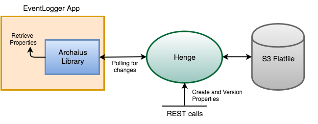

[[henge-overview]]
= Henge Overview
:sectnums:
:icons: font

From the dawn of time, developers have been storing configurations for their application in Java properties files. Whenever they pushed their application from one environment to the next (during deployment), they would request that the properties files be edited to reflect the unique values needed for each environment. After a while, even if the software could be produced as an artifact, the configs were hopelessly jumbled across the enterprise. Any exercise in resolving config values within the environment or across environments would lead to premature gray hair. 

Although many enterprises are now moving to key-value stores to retrieve properties and alleviate the file chaos, most of these key-value stores lack a complete hierarchical properties model that supports the application lifecycle. 

== Enter Henge

At Kenzan, we grew interested in this apparent property service gap through our own experience in developing a properties store using Netflix Archaius. In particular, we noted Archaius’ https://github.com/Netflix/archaius/issues/132[open issue #132^], which calls for creating a central properties service that separates the persistence of properties from Archaius. The question then became, how could we build something that fills this gap, is feature rich and marries well with modular application design? 

Enter Henge, a REST-based property server that aims to bring order to configuration properties in a number of ways:

* Make configs first class, versioned and immutable artifacts, just like software. 
* Group all possible environment values for a property in one place, preventing confusion and dismay.
* Define property groups for each of the libraries composing an application, and aggregate them into a single application config. 
* Put the configs on the network where they can be updated centrally for all applications.

== The Henge Properties Model

How does Henge accomplish all this? Its primary value lies in how it models properties using JSON objects. The two most basic building blocks are Property Groups and Scopes. 

|===
| *Property Groups* contain a set of properties related to your application. Property Groups can be of type APP, representing the application itself, or of type LIB, representing a dependent library with its own set of properties. Each Property Group is immutable and has a version.
| *Scopes* define cases where a property will have different values depending on the environment it is running in. Scopes, along with the different property values, can be defined within each Property in the Property Group.  
|===

As an example, you might have a Property Group for a SendEmail library that supports your application. It has a *supportEmail* property, which has different values for dev, staging and prod environments. In Henge, you would define it as: 

*Property Group:* SendEmail (type=LIB, v1.0) 

* *Property:* supportEmail
** defaultValue = test@awesome.com
** Scopes
*** env=dev
**** value = testSupport@awesome.com
*** env=stage
**** value = stageSupport@awesome.com
*** env=prod
**** value = techsupport@awesome.com
* *Property:* anotherProperty… 

For supportEmail there are three scopes — *env=dev*, *env=stage*, *env=prod* — each of which have different values. The scope key is env, defining a new type of scoping. During runtime, a search is performed on Henge using one of these environment scopes to determine what property value it should retrieve for the application in that environment. Note that there is also a *defaultValue*: if none of the three environments are referenced when searching, it will use the default value. 

For more complex environments, you can also define sets of scopes. Some examples of scope sets that define an environment might include: 

* *env*=staging
* *env*=dev, *region*=us-west-2
* *env*=prod, *region*=us-west-2, *stack*=coolwebsiteA
* *env*=qa, *region*=us-west-2, *stack*=financePages, *hostname*=localhost 

Within each property you can specify one or more scope sets and give a property value for each scope set. If a property has multiple different values based on a complex environment, a hierarchy is used to determine precedence for the various values a property could take on. For more information, see <<domain_reference#domain-objects,Domain Objects>>.

== Versions and Mappings

There are two other important pieces to the model that bring it all together. Once you’ve set up Property Groups or File Versions for an application, you group them in a Version Set representing the application as a whole, and create a Mapping used to search for a complete set of properties. 

|===
| A *Version Set* references multiple Property Groups of type APP or LIB, and defines a complete set of properties for an application. A Version Set is immutable, and has its own version separate from the various Property Groups. Note that it can reference a Property Group with “latest” as the symbolic version, to always include the most recent version of the Property Group. 
| *Mappings* link a specific version of a Version Set to an application running in a specific environment (defined by the Scopes). When a search request is sent to Henge, it uses this Mapping to get all properties for the application on its environment. The Mapping itself is mutable, and can also reference the “latest” symbolic version of a Version Set.  
|===

Expanding on our previous example, let’s assume that we are building a brand new EventLogger application that logs events to a logging database. Some things to know about our application:

* The EventLogger application itself has its own set of properties. 
* EventLogger uses two other libraries that have their own properties: an EventDB library for storing events, and the previously mentioned SendEmail library for sending emails. 
* EventLogger relies on searching through a very long EventHierarchy for categorizing Events into logging actions. This is contained in a JSON text file.

Based on this we create Property Groups, a File Version and a Version Set for the application like so: 

image::VersionSet1.png[Version Set 1.0]

Within the Version Set we are referencing the “latest” versions of the Property Groups and File Version, in this case 1.0.  

EventLogger runs on dev, stage and prod environments. Many properties in the three Property Groups can have different values in these environments. As we did in the previous SendEmail example, we use dev, stage and prod scopes to assign different property values for those properties that differ in the environments. 

We also create three Mappings that link the application and its environments to the “latest” EventLogger Version Set (in this case 1.0):   

* EventLogger app running on env=dev  	-> 	EventLogger Version Set (latest) 
* EventLogger app running on env=stage 	-> 	EventLogger Version Set (latest)
* EventLogger app running on env=prod 	-> 	EventLogger Version Set (latest) 

Each of the above Mappings represent a complete set of properties that we can search for and retrieve from Henge, depending on the environment the application is running in.   

== Henge in Architecture and App Lifecycle

Now that we have defined a good properties model for our EventLogger application, how does the application get those properties from Henge in our architecture, and how are properties versioned as an artifact alongside our application through its lifecycle? 

=== Storing, Running and Getting

Henge currently supports pluggable persistence on three repository types — flatfile local, flatfile on S3, and Cassandra (though Henge could easily be extended to use any data store such as RDBMS, Hibernate, etc.). Because our fictional engineering shop has ample S3 space that is backed up, we opt to run Henge using an S3 flatfile repository. 

We intend to have many applications use Henge for accessing properties going forward, not just EventLogger. All of our current applications use Netflix Eureka for discovery and request load balancing, so we’d like to do the same with Henge. We make the obvious decision of running Henge with its built-in Eureka client. This is swiftly accomplished by referencing a Spring Profile on the Henge run command.    

Netflix Archaius is also commonly used in many of our applications as a library to retrieve properties. We determine to use a simple integration between Archaius and Henge. On startup, EventLogger loads properties to Archaius. This is accomplished with the Archaius configuration source URL setting, which we set to the Henge search REST endpoint whose function is to retrieve property sets. Archaius polls the Henge search endpoint occasionally for updates. At runtime, EventLogger grabs individual properties as needed using Archaius libraries, and receives dynamic changes to properties as they occur. It is worth noting that any property library could be used to get individual properties, such as Java Properties classes or Apache Commons Configuration.

How Henge fits in our architecture now looks as follows: 

=== A Typical Lifecycle (Issues Included)  

During development, the EventLogger application goes through several iterative versions where property values change. Property Groups are versioned as needed. Nothing needs to change in the Version Set, as it already references the “latest” version of Property Groups. All the same, we create a new version of the Version Set to parallel the new application version - this will make it easier to perform a rollback should it ever be required (more on this later). The Mappings do not change, as they reference the latest Version Set. 

When EventLogger v2.0 is ready for staging, the properties model is:  

image::VersionSet2.png[VersionSet 2.0]

In *staging*, we’d like to test out the performance of how Henge is loading properties via Archaius’ polling, as the properties and file that are loaded are quite large. Using Henge’s built in Codahale metrics, as well as Henge’s pre-built Docker container that runs a metrics environment with InfluxDB and Grafana, Henge is started in staging and run through several test scenarios. With the captured data, it’s determined that the REST call loading properties from Henge is quite fast, but that it is best to tweak the polling in Archaius to be less frequent so that resources are more efficiently used elsewhere.  

After EventLogger has gone to *production*, it’s found that the number of thread pools assigned to DB calls is too low and is causing the application to slow down. This thread pool count can be increased in EventDB properties. A single REST call is made to update the EventDB Property Group with the increased thread pool count. Because it is immutable, a new version 1.6 is created, and the Version Set automatically references this latest Property Group. Archaius picks up the change in Henge via polling, and the application automatically starts using the new thread pool count. Happily, we didn’t have to rebuild and redeploy the application to accomplish this feat. 

EventLogger later goes through a *release cycle* with several enhancements for version 3.0. During the overhaul, the 3rd party SendEmail library has had a fresh update, and so its property configuration has changed. There is also a new MetricsClient library used by EventLogger to interface with a MetricDB server. The MetricsDB server is a homegrown application that has its own set of properties that will managed by Henge in a separate Version Set, and the MetricsClient will require its own set of properties. For EventLogger, we create a new Property Group for the MetricsClient library, version the SendEmail properties, and version the Version Set to reference to the new MetricsClient properties. Going to production with EventLogger v3.0, our new properties model looks as follows: 

image::VersionSet3.png[VersionSet 3.0]

Initially everything goes smoothly when moving back into production, but then, disaster strikes. *Something goes horribly amiss* with the new Metrics server, and EventLogger comes to a staggering halt. It’s going to take some time to figure out the root cause and fix it, so it’s decided the best path is to roll back to EventLogger 2.0 in the meantime. The older version of the application is redeployed, and alongside it, we take care of properties by simply referring back to the older Version Set 2.0. To do so we make a single REST call to update the production Mapping -- instead of referencing “latest” for the Version Set, we set it to 2.0. Later when we can find the monkey in our wrench and fix the problem, we can go back into production by re-updating the production Mapping to reference “latest.”

You might ask yourself, how would my own engineering shop have handled such a rollback with its current properties architecture?

== Back to the Neolithic

Having seen how Henge allows properties to be centrally versioned across the bumps in an application lifecycle, going back to using .properties files or a simple key-value store seems contrary to the immutable nature of the application itself. Just as Henges were once needed as community gathering places for sharing core ideas carved in stone, your microservice apps need a gathering place for their foundational key values. In this case, going back to the Neolithic Age is not such a bad idea after all. 

To quickly download, run and test Henge, see our https://github.com/kenzanlabs/henge/wiki[Getting Started page on Github^]. Or read on for some more specifics.

=== Feature Summary

* Henge is a central dynamic property store with a REST-based interface for easy integration. 
* It offers pluggable persistence — currently flatfile, flatfile on S3, and Cassandra are included as repository options, though Henge could easily be extended to use any data store (RDBMS, Hibernate, etc.). 
* Henge has smart modeling of properties that accounts for different property values across deployment environments. 
* The property model lets you define property groups for each of the libraries composing an application, and aggregate them into a single application config. 
* Everything is immutable and includes a version. The result is a complete view of how properties have changed as your application has grown, with an application config that moves as an artifact alongside your application. 
* In addition to properties, Henge stores and retrieves any related files an application might parse. 
* Before properties are put into Henge, they are validated with JSR 303 bean validation. 
* A Docker container is included for running Henge in a container environment. 
* Henge is built with high performance in mind to support properties dynamically changing. 
* The REST calls to Henge have Codahale metrics built in. We also include a pre-built Docker metrics environment that uses InfluxDB and Grafana to record and visualize those metrics. 
* Henge is built with integration to Eureka, so that it can be deployed as a Eureka client that is discoverable and load balanced.
* It is easily integrated with Archaius for dynamic property retrieval, but property retrieval works with any language or library that can make a REST call to a URL.
* Spring Security is enabled to allow authorization to be set up for the various Henge REST calls. 
Henge uses Spring Profiles at runtime to select and modify its various features. 

=== Henge Architecture

We built Henge using a suite of modern, flexible open source frameworks and libraries. The architecture below also highlights several future enhancements we are looking at — though by all means fork freely on the https://github.com/kenzanlabs/henge[Henge Github page^].  

image::henge_architecture.png[Henge Architecture]

[cols="1,3", options="header"]
|===
| Henge Component      | Technology
.3+<| Core            <| Domain Objects (discussed above)
                      <| https://docs.spring.io/spring-boot/docs/current/reference/html/boot-features-profiles.html#boot-features-profiles[Spring Profiles^]
                      <| http://beanvalidation.org/1.0/spec/[JSR 303 bean validation^]
.4+<| Persistence     <| Flatfile
                      <| https://aws.amazon.com/s3/[Amazon S3^] (flatfile)
                      <| http://cassandra.apache.org/[Cassandra^]
                      <| RDBMS / http://hibernate.org/[Hibernate^] (future)
.2+<| HTTP Server     <| http://tomcat.apache.org/[Tomcat^]
                      <| http://www.eclipse.org/jetty/[Jetty^]
| Services            <| REST / https://jersey.java.net/[Jersey^]
.2+<| Security        <| http://projects.spring.io/spring-security/[Spring Security^] -- Authentication, Authorization, and Session (future)
                      <| LDAP / https://www.atlassian.com/software/crowd[Atlassian Crowd^] (future)
.2+<| Web Application (future) <| http://www.w3schools.com/html/html5_intro.asp[HTML5^] / http://www.w3schools.com/css/css3_intro.asp[CSS3^]
                      <| https://angularjs.org/[AngularJS^] / http://getbootstrap.com/[Bootstrap^]
| WebSockets (future) <| https://github.com/Atmosphere/atmosphere[Atmosphere^]
|===
