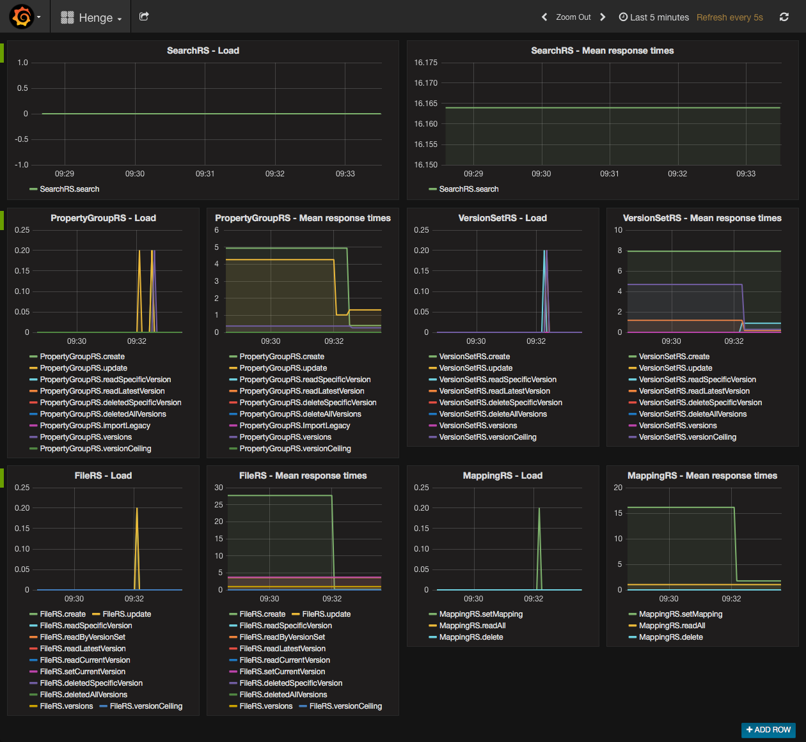

[[metrics]]
= Metrics
:sectnums:
:icons: font

Think of metrics as a way to add instrumentation to your application. Just as instruments like gauges and tachometers give you useful information while driving your car, metrics let you see relevant usage and performance data for your application while it's running.

Henge offers metrics for each service endpoint that allow you to monitor their execution. We rely on http://metrics.dropwizard.io/[Dropwizard Metrics^] and its integration with http://docs.spring.io/spring-boot/docs/current/reference/htmlsingle/#production-ready[Spring Actuator^] to provide metrics values. These values are stored in an https://influxdata.com/time-series-platform/influxdb/[Influx DB^] database, and they are made available for visualization on a http://grafana.org/[Grafana^] dashboard.

== Required Services

To run Henge and publish metrics, the InfluxDB and Grafana servers must be running. In addition, Henge needs to be configured to publish metrics data to the InfluxDB server.

To simplify this process, and to provide an environment for the purposes of load test analysis, we created Docker images. With Docker, you can quickly start up the metrics environment without having to indvidually install and configure the required services.

[NOTE]
====
The purpose of the Docker images is to provide a metrics environment for temporary use, such as test analysis. This is why the metrics services are configured to run on the same host as Henge.

If you need to run the metrics environment for longer periods, it's best to configure the metrics environment on another host. In this case, you need to change the class *MetricsConfig.java* (in the *henge-service* module) to point to the new InfluxDB host.
====

== Configuring Docker

You must install and configure Docker to run the Docker containers for metrics. Follow the steps below for your operating system.

=== macOS

For systems running macOS, install and configure the Docker Toolbox. This runs Docker in a virtual machine that you can access using the Docker Quickstart Terminal.

1. Open the file */henge-service/src/main/resources/application-metrics.yml* in a text editor (like *TextEdit*) and change the value for `metrics.influxdb.host` to `192.168.99.100`:
+
[source]
----
# Metrics - InfluxDB Configuration
metrics.influx:
    host: 192.168.99.100 //<1>
    port: 8086
    user: admin
    password: admin
    database: henge
    periodInSeconds: 5
----
<1> Change this value to `192.168.99.100`, and then save and close the file.

2. Download the https://www.docker.com/products/docker-toolbox[Docker Toolbox package for Mac^].

3. Double-click the package to run the installer, and then follow the https://docs.docker.com/toolbox/toolbox_install_mac/[installation instructions^].

4. When you reach the *Quick Start* step, select the *Docker Quickstart Terminal* option. This will launch the Docker terminal.
+
NOTE: In the future, if you need to launch the Docker terminal, open the *Docker* folder in your *Applications* folder, and then double-click *Docker Quickstart Terminal*.

5. Configure required environment variables. To do this, enter the following commands in the Docker terminal (press *<Enter>* after each command):
+
[source]
----
export DOCKER_CERT_PATH=~/.docker/machine/certs
export DOCKER_HOST=tcp://192.168.99.100:2376
export DOCKER_TLS_VERIFY=1
----

Docker is now ready to go. Keep the terminal window open, and continue with <<Starting InfluxDB and Grafana>> below.

=== Linux

For systems running Linux, install and configure the Docker Engine. This runs Docker natively on your system (rather than inside a virtual machine, like on macOS).

1. Open the file */henge-service/src/main/resources/application-metrics.yml* in a text editor and make sure the value for `metrics.influxdb.host` is `127.0.0.1`:
+
[source]
----
# Metrics - InfluxDB Configuration
metrics.influx:
    host: 127.0.0.1 //<1>
    port: 8086
    user: admin
    password: admin
    database: henge
    periodInSeconds: 5
----
<1> If necessary, change this value to `127.0.0.1`, and then save and close the file.

2. Install Docker by following the https://docs.docker.com/engine/installation/[installation instructions^] for your Linux distribution.

3. Configure the Docker daemon to enable communication with the Maven plug-in. To do this, open the file */etc/default/docker* in a text editor and add the following line:
+
[source]
----
DOCKER_OPTS="-H tcp://127.0.0.1:4041 -H unix:///var/run/docker.sock" //<1>
----
<1> The IP address must be the same as for `localhost`, but the port can be modified as needed. Using the default port of `2376` caused issues, so here we are using port `4041` instead.

4. Restart Docker using the following command:
+
[source]
----
sudo restart docker
---- 

5. Set the `DOCKER_HOST` environment variable using the following command: 
+
[source]
----
export DOCKER_HOST=tcp://127.0.0.1:4041 //<1>
---- 
<1> Use the same port as in Step 3 above.

Docker is now ready to go. Keep the terminal window open, and continue with <<Starting InfluxDB and Grafana>> below.

== Starting InfluxDB and Grafana

To start the metrics environment, change to the root directory of the project, and then use the following command:

[source]
----
mvn -pl henge-docker -P metrics
----

WARNING: When running this command, make sure you are in the same terminal window you used to export the environment variables.

== Starting Henge With Metrics Enabled

To start Henge and enable publishing of metrics to InfluxDB, change to the root directory of the project, and then use the following command:

[source]
----
mvn -pl henge-service spring-boot:run -Dspring.profiles.active=dev,flatfile_local,metrics
----

WARNING: When running this command, make sure you are in the same terminal window you used to export the environment variables.

NOTE: The `-Dspring.profiles.active` switch is used to specify the Spring profiles to activate when running Henge. You can specify different profiles as needed. However, to publish metrics values, the `metrics` profile must be active. See <<profiles_reference#profiles,Profiles>> for more information.

=== Accessing InfluxDB

Metrics are published to InfluxDB each time an endpoint is used. To access the InfluxDB web interface, use the appropriate URL for your operating system:

*macOS*:: `http://192.168.99.100:8083`

*Linux*:: `http://127.0.0.1:8083`

=== Accessing Grafana

The Grafana dashboard loads metrics values from InfluxDB and makes them available for visualization.  To access the Grafana dashboard, use the appropriate URL for your operating system:

*macOS*:: `http://192.168.99.100:3000`

*Linux*:: `http://127.0.0.1:3000`

You can view the dashboard by clicking *Home* in the top banner, and then clicking *Henge*.

.Henge Dashboard
