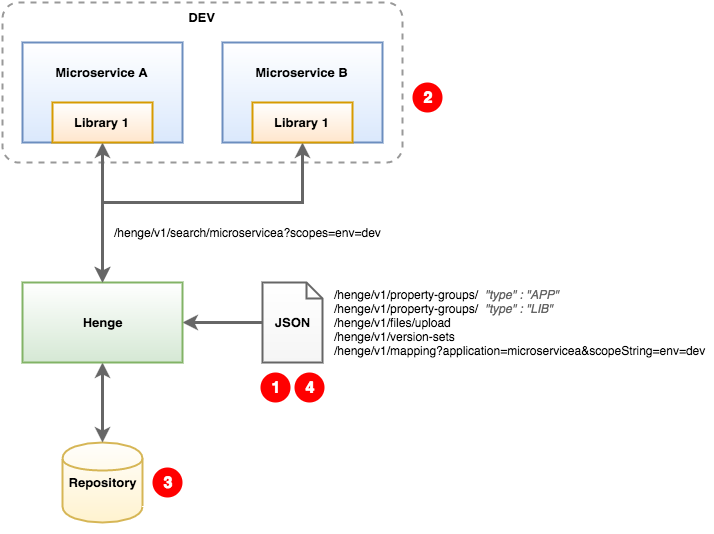

[[use-case-simple-app]]
= Use Case: Simple Application
:sectnums:
:icons: font

As a developer building cloud-native applications, you need a service to host your application configurations so that you can deploy config changes on the fly without needing to rebuild your apps. Files would be nice, too! Your environment isn't too complex, just a single application consisting of about a dozen microservices with separate environments for Dev, QA, and Prod. Good news--Henge can definitely help you out.

== Overview

In this use case, we have a simple application that is made up of several microservices, each of which can include shared libraries as dependencies. The microservices can be deployed in multiple environments, such as development and production. Microservices require different property values depending on the environment they are deployed in.

. Properties are loaded into the repository using Henge:
* Properties for each microservice are stored in a PropertyGroup of type `APP` (one for each microservice).
* Properties for each library are stored in a PropertyGroup of type `LIB` (one for each library).
* The PropertyGroups are added to a VersionSet (one for each microservice). The VersionSet references all properties used by the microservice as well as any included libraries. (The VersionSet can also reference FileVersions--files with parsable data.)
* The VersionSet is mapped to application (microservice) and scope (environment). For each application, a mapping is created for each relevant environment scope (such as *dev* and *prod*).

. At runtime, each microservice requests properties from the Henge service using a URL. The URL includes the application name and (optionally) the environment as query parameters.

. Henge retrieves the appropriate properties for the microservice and environment from the repository, including properties for any shared libraries or referenced files, and returns them to the application.

. Properties can be updated with new values in Henge at any time by making a REST call. The application will receive the new properties the next time it polls Henge.

.Use Case Overview: Simple Application

== Creating Properties

Use the following requests to load application properties in the Henge repository.

NOTE: Alternately, you can use the http://localhost:8080/henge/swagger/index.html#!/v1_-_convenience/batchInsert[`http://localhost:8080/henge/v1/convenience/batch`^] endpoint to load a PropertyGroup, VersionSet, and Mapping in a single step.

=== Create a PropertyGroup

A PropertyGroup contains properties that belong to the same context, such as a single application. To create a PropertyGroup, use the http://localhost:8080/henge/swagger/index.html#!/v1_-_property-groups/create[`http://localhost:8080/henge/v1/property-groups/`^] endpoint.

The request body must be in JSON format and should contain the PropertyGroup name and version, as well as key value pairs for each property and environment (see <<domain_reference#domain-objects,Domain Objects>>). Define one PropertyGroup of type `APP` for each microservice. In addition, define one PropertyGroup of type `LIB` for each shared library. All microservices that include the shared library will use the same library properties.

NOTE: To use a file (such as a list of IP addresses) as part of the configuration, create a FileVersion using the http://localhost:8080/henge/swagger/index.html#!/v1_-_files/upload[`http://localhost:8080/henge/v1/files/upload/`^] endpoint.

[source,options="nowrap"]
----
{
  "name" : "SimpleAppServiceA",
  "version" : "1.0.0",
  "description" : "Simple App Microservice A",
  "type" : "APP",
  "active" : true,
  "properties" : [ {
    "name" : "simpleapp.appmessage",
    "description" : "Message property",
    "defaultValue" : "Some message",
    "propertyScopedValues": [
        {
          "value": "Hello in Development Environment (APP)",
          "scopeSet": [
            {
              "key": "env",
              "value": "dev"
            }
          ]
        },
        {
          "value": "Hello in Production Environment (APP)",
          "scopeSet": [
            {
              "key": "env",
              "value": "prod"
            }
          ]
        }
      ]
    }, {
        "name" : "simpleapp.appname",
        "description" : "An APP Property",
        "defaultValue" : "Some value",
        "propertyScopedValues" : [
            {
          "value": "APP Property for Microservice A (Development Mode)",
          "scopeSet": [
            {
              "key": "env",
              "value": "dev"
            }
          ]
        },
        {
          "value": "APP Property for Microservice A (Production Mode)",
          "scopeSet": [
            {
              "key": "env",
              "value": "prod"
            }
          ]
        }    
        ]
  } ]
}
----

=== Create a VersionSet

A VersionSet groups together specific versions of PropertyGroups. (A VersionSet can include FileVersions as well.) To create a VersionSet, use the http://localhost:8080/henge/swagger/index.html#!/v1_-_version-sets/create[`http://localhost:8080/henge/v1/version-sets`^] endpoint.

The request body must be in JSON format and should contain the VersionSet name and version, as well as the PropertyGroup name and version (see <<domain_reference#domain-objects,Domain Objects>>). Define one VersionSet for each microservice. The VersionSet should include the `APP` PropertyGroup for the microservice, as well as the `LIB` PropertyGroup for each shared library included in the microservice.

NOTE: Instead of specifying a specific version of a PropertyGroup, you can instead specify `"version": "latest"` for version. In this case, the VersionSet will always include the most recent version of the PropertyGroup.

[source,options="nowrap"]
----
{
  "name": "SimpleAppVersionSetServiceA",
  "version": "1.0.0",
  "description": null,
  "propertyGroupReferences": [
    {
      "name": "SimpleAppServiceA",
      "version": "1.0.0"
    },
    {
      "name": "SimpleAppLibrary1",
      "version": "1.0.0"
    }
  ],   
  "createdDate": null,
  "scopedPropertyValueKeys": null,
  "typeHierarchyEnabled": true
}
----

=== Create a Mapping

A Mapping entry associates a set of Scopes with a specific version of a VersionSet. To create a Mapping, use the http://localhost:8080/henge/swagger/index.html#!/v1_-_mapping/setMapping[`http://localhost:8080/henge/v1/mapping`^] endpoint.

Create a mapping for each microservice. You must include the `application` parameter with the URL to associate the VersionSet with the correct microservice. Optionally, you can include the `scopeString` parameter to associate the VersionSet with a particular scope (environment):

[source,options="nowrap"]
----
http://localhost:8080/henge/v1/mapping?application=microservicea&scopeString=env=dev
----

The request body must be in JSON format and should contain the VersionSet name and version (see <<domain_reference#domain-objects,Domain Objects>>).

[source,options="nowrap"]
----
{
    "name": "SimpleAppVersionSetServiceA",
    "version": "1.0.0"
}
----

== Retrieving Properties

Properties can be retrieved at microservice runtime using a URL to access the http://localhost:8080/henge/swagger/index.html#!/v1_-_search/findMatches[Henge search API^]. The URL must include the application (microservice) as a query parameter:

[source,options="nowrap"]
----
http://localhost:8080/henge/v1/search/microservicea
----

In the above example, the default property values are retrieved. To retrieve property values for a specific scope, the URL must also include the scope (such as the environment) as a query parameter:

[source,options="nowrap"]
----
http://localhost:8080/henge/v1/search/microservicea?scopes=env=dev
----

NOTE: To retrieve environment-specific properties, the microservice must be able to send the correct query parameter for the environment that it's running in. This can be handled in several ways, for example, by creating a Maven profile for each environment. For an example of profiles in action, see <<hello_properties#hello-properties,the Hello Properties demo application>>.

=== Java Properties API

To retrieve properties using Java:

[source,options="nowrap"]
----
URL url = new URL("http://localhost:8080/henge/v1/search/microservicea");
InputStream in = url.openStream();
Reader reader = new InputStreamReader(in, "UTF-8"); // for example
 
Properties prop = new Properties();
try {
    prop.load(reader);
} finally {
    reader.close();
}
----

=== Commons Configuration

To retrieve properties using http://commons.apache.org/proper/commons-configuration/[Apache Commons Configuration^]: 

[source,options="nowrap"]
----
Parameters params = new Parameters();
// Read data from this URL
URL propertiesURL = new URL("http://localhost:8080/henge/v1/search/microservicea");

FileBasedConfigurationBuilder<FileBasedConfiguration> builder =
    new FileBasedConfigurationBuilder<FileBasedConfiguration>(PropertiesConfiguration.class)
    .configure(params.fileBased()
        .setURL(propertiesURL));
try
{
    Configuration config = builder.getConfiguration();
    // config contains all properties read from the URL
}
catch(ConfigurationException cex)
{
    // loading of the configuration file failed
}
----

Make sure to add the following dependency to the Maven *pom.xml* file for your project:

[source,options="nowrap"]
----
<dependency>
  <groupId>org.apache.commons</groupId>
  <artifactId>commons-configuration2</artifactId>
  <version>2.1</version>
</dependency>
<dependency>
    <groupId>commons-beanutils</groupId>
    <artifactId>commons-beanutils</artifactId>
    <version>1.9.2</version>
</dependency>
----

=== Archaius

To retrieve properties using https://github.com/Netflix/archaius[Netflix Archaius^]:

. Add a dependency for Archaius to the Maven *pom.xml* file for your project:
+
[source,options="nowrap"]
----
<dependency>
    <groupId>com.netflix.archaius</groupId>
    <artifactId>archaius-core</artifactId>
    <version>0.7.4</version>
</dependency>
----

. Also in the *pom.xml* file, add a dependency for the Tomcat Maven plug-in and specify the following Archaius properties:
+
[options="header"]
|===
| Property | Value
| archaius.configurationSource.defaultFileName | Default configuration file name (use `config.properties`)
| archaius.configurationSource.additionalUrls | Henge search URL with query parameters
| archaius.fixedDelayPollingScheduler.initialDelayMills | Initial delay (in milliseconds) before reading from Henge
| archaius.fixedDelayPollingScheduler.delayMills | Delay (in milliseconds) between reads from Henge
|===

+
[source,options="nowrap"]
----
<plugin>
    <groupId>org.apache.tomcat.maven</groupId>
    <artifactId>tomcat7-maven-plugin</artifactId>
    <version>2.2</version>
    <configuration>
        <path>/microservicea</path>
        <port>${tomcat.port}</port>
        <useTestClasspath>false</useTestClasspath>
        <systemProperties>
            <application.home>${basedir}${file.separator}src${file.separator}test${file.separator}resources${file.separator}</application.home>
            <http.port>${tomcat.port}</http.port>
            <archaius.configurationSource.defaultFileName>config.properties</archaius.configurationSource.defaultFileName>
            <archaius.configurationSource.additionalUrls>http://localhost:8080/henge/v1/search/microservicea</archaius.configurationSource.additionalUrls>
            <archaius.fixedDelayPollingScheduler.initialDelayMills>1000</archaius.fixedDelayPollingScheduler.initialDelayMills>
            <archaius.fixedDelayPollingScheduler.delayMills>10000</archaius.fixedDelayPollingScheduler.delayMills>
        </systemProperties>
    </configuration>
</plugin>
----

NOTE: For an example of using Archaius, see the *pom.xml* file for the *hello-properties* application, located in the */hello-properties* directory. 

== Updating Properties

Property values can be changed at any time, even while the application is running, by updating a PropertyGroup as well as the relevant VersionSets and Mappings. You don't have to rebuild or redeploy the application.

To update a PropertyGroup, use the http://localhost:8080/henge/swagger/index.html#!/v1_-_property-groups/update[`/v1/property-groups/{propertyGroupName}`^] endpoint. The request body is the same as when creating a PropertyGroup, but make sure to increment the version number in addition to updating property values.

NOTE: To update a FileVersion, use the http://localhost:8080/henge/swagger/index.html#!/v1_-_files/update[`http://localhost:8080/henge/v1/files/update/`^] endpoint.

After updating a PropertyGroup, you need to update the VersionSet and Mapping for any applications that should use the updated properties:

* Update the VersionSets to refer to the new PropertyGroup version using the http://localhost:8080/henge/swagger/index.html#!/v1_-_version-sets/update[`/v1/version-sets/{versionSetName}`^] endpoint. 

* Update the Mappings to refer to the new VersionSet version using the http://localhost:8080/henge/swagger/index.html#!/v1_-_mapping/setMapping[`http://localhost:8080/henge/v1/mapping/`^] endpoint. 

== Try it Out

Use the following https://www.getpostman.com/[Postman^] requests to load and retrieve properties using a URL.

NOTE: Before trying the examples below, make sure the Henge server is up and running (see <<getting_started#getting-started,Getting Started>>).

First, import the Henge Use Case Simple App Postman collection:

. In Postman, click *Import*, and then click *Choose Files*.
. Select the *HengeUseCaseSimpleApp.postman_collection.json* file (located in the */documentation/demo/* directory), and then click *Open*.

Next, send the following requests (located under the *HengeUseCaseSimpleApp* collection in Postman):

[cols="1,2", options="header"]
|===
| Request | Description
| 1. Create APP PropertyGroup - Microservice A | Creates an APP PropertyGroup named *SimpleAppServiceA*.
| 2. Create APP PropertyGroup - Microservice B | Creates an APP PropertyGroup named *SimpleAppServiceB*.
| 3. Create LIB PropertyGroup - Library 1 | Creates a LIB PropertyGroup named *SimpleAppLibrary1*.
| 4. Create VersionSet - Microservice A | Creates a VersionSet named *SimpleAppVersionSetServiceA* that contains the PropertyGroups *SimpleAppServiceA* and *SimpleAppLibrary1*.
| 5. Create VersionSet - Microservice B | Creates a VersionSet named *SimpleAppVersionSetServiceB* that contains the PropertyGroups *SimpleAppServiceB* and *SimpleAppLibrary1*.
| 6. Create Mapping for Dev - Microservice A | Associates the VersionSet *SimpleAppVersionSetServiceA* with the application named *microservicea* and the *dev* environment.
| 7. Create Mapping for Dev - Microservice B | Associates the VersionSet *SimpleAppVersionSetServiceB* with the application named *microserviceb* and the *dev* environment.
| 8. Retrieve Properties for Dev - Microservice A | Returns the properties associated with the application *microservicea* and the *dev* environment. The properties returned include APP properties for Microservice A as well as LIB properties for Library 1.
| 9. Retrieve Properties for Dev - Microservice B | Returns the properties associated with the application *microserviceb* and the *dev* environment. The properties returned include APP properties for Microservice B as well as LIB properties for Library 1.
| 10. Update APP PropertyGroup - Microservice A | Updates the APP PropertyGroup named *SimpleAppServiceA* with new property values and increments to v1.0.1.
| 11. Update VersionSet - Microservice A | Updates the VersionSet named *SimpleAppVersionSetServiceA* to reference v1.0.1 of the PropertyGroup *SimpleAppServiceA* and increments to v1.0.1.
| 12. Update Mapping for Dev - Microservice A | Associates the VersionSet *SimpleAppVersionSetServiceA* v1.0.1 with the application named *microservicea* and the *dev* environment.
| 13. Retrieve Properties for Dev - Microservice A | Returns the properties associated with the application *microservicea* and the *dev* environment. Note that the v1.0.1 properties are returned.
|===

NOTE: There are also Postman requests for mapping and retrieving properties for the *prod* environment. Send these requests if you'd like to test getting properties for another environment.
